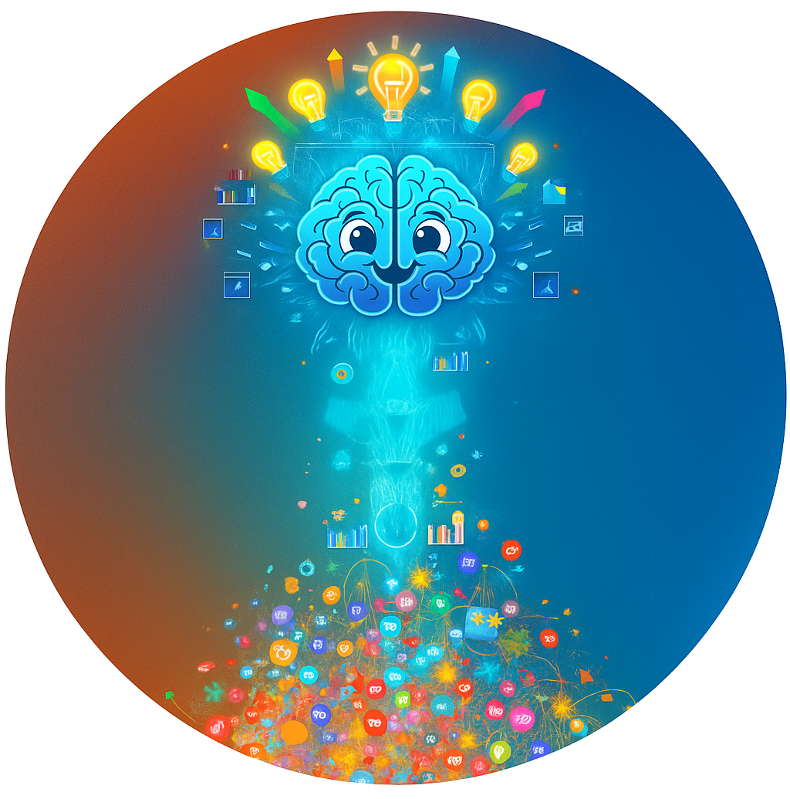

# Projeto de criação de um podcast feito com ferramentas de I.A.

  

Projeto com o objetivo de gerar um Ebook utilizando ferramentas de IA através de prompts mais trabalhado e Power Point.

Utilizei de prompts mais detalhadas para fazer com que os agentes de IA trabalhassem como mentores para me ajudar a refinar a ideia e construir o Ebook com um tema da minha preferência e que já tenho certo conhecimento.

## 💻 Tecnologias utilizadas no projeto

- [ChatGPT](https://chat.openai.com/) 
- [Copilot](https://copilot.microsoft.com/)
- [Google](https://www.google.com/)
- Power point

## ✨ Como foi feito ?
- Refinamento das minhas ideias para design e conteúdo com agentes de IA
- Criação de imagens com agentes de IA
- Revisão do conteúdo por buscas no google e com agentes de IA
- Uso do Power Point para criação do documento

---
## 👨‍💻 Expert

    
&nbsp&nbsp&nbspSabrina Ramos Prado 
    &nbsp&nbsp&nbsp
    <a 
        href="https://github.com/srprado">
        GitHub
    </a>
    &nbsp;|&nbsp;
    <a 
        href="https://www.linkedin.com/in/sabrinarprado/">
        LinkedIn
    </a>
    &nbsp;|&nbsp;
   

  

